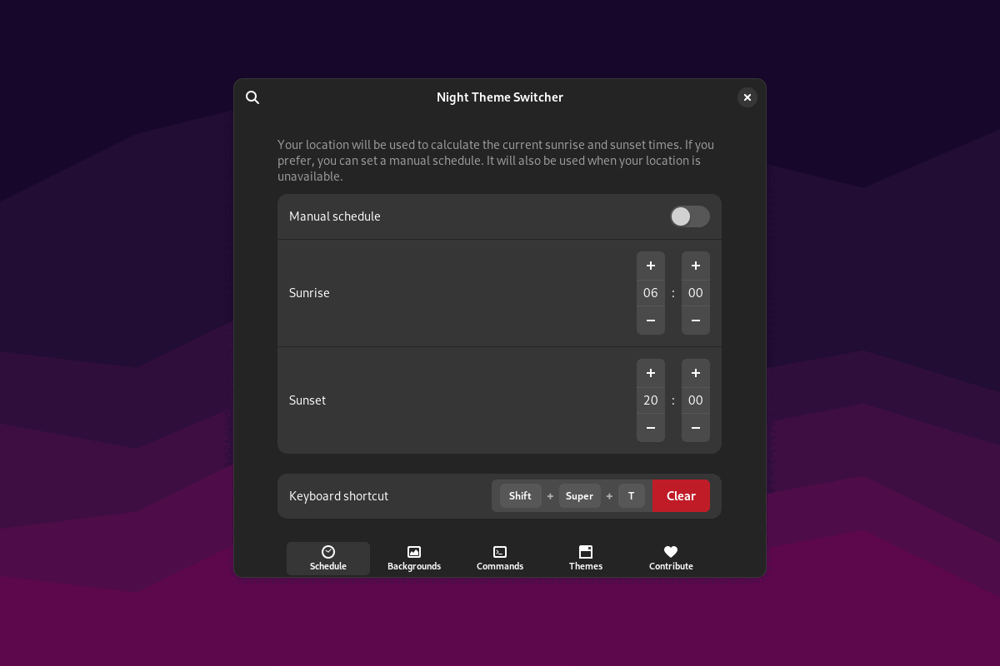

<!--
SPDX-FileCopyrightText: 2021 Romain Vigier <contact AT romainvigier.fr>
SPDX-License-Identifier: CC-BY-SA-4.0
-->

# Night Theme Switcher <!-- omit in toc -->



Automatically toggle your desktop’s color scheme between light and dark, switch backgrounds and run custom commands at sunset and sunrise.

---

## Table of contents <!-- omit in toc -->

- [Graphical installation](#graphical-installation)
- [Command line installation](#command-line-installation)
- [Contributing](#contributing)
- [Frequently asked questions](#frequently-asked-questions)

---

## Graphical installation

Visit [the extension page on extensions.gnome.org](https://extensions.gnome.org/extension/2236/night-theme-switcher/) and enable the extension.

## Command line installation

You will need these tools:

- `meson`
- `gettext`
- `glib-compile-schemas`
- `glib-compile-resources`

Clone the repository and enter the directory:

```bash
git clone https://gitlab.com/rmnvgr/nightthemeswitcher-gnome-shell-extension.git && cd nightthemeswitcher-gnome-shell-extension
```

Build and install using `meson`:

```bash
# System-wide installation
meson builddir && meson install -C builddir

# User installation
meson builddir --prefix=~/.local && meson install -C builddir
```

Restart your GNOME session and enable the extension:

```bash
gnome-extensions enable nightthemeswitcher@romainvigier.fr
```

## Contributing

You're welcome to contribute to the code or the translations! See [CONTRIBUTING.md](./CONTRIBUTING.md).

## Frequently asked questions

### Some applications don't switch their appearance

Like GNOME's built-in dark mode, the extension switches the standard freedesktop.org color scheme preference. Older applications might not follow this preference.

It is possible to force a GTK theme in the extension preferences, but please note that this can visually break applications. It is better to ask the developers of the applications to support the standard preference.

### Something doesn't work on Ubuntu

Unfortunately, Ubuntu ships heavily modified GNOME components to implement some features like accent colors. Because they did so in a very hacky way instead of working with upstream and other desktop projects on a proper solution, it results in a broken out of the box experience with the extension, which expects a standard environment. Not much can be done as I don't want to code workarounds on top of hacks.

To mitigate that, please:

- Enable GTK theme switching in the extension preferences and choose the themes with your desired accent color
- Enable Shell theme switching in the extension preferences and choose the themes with your desired accent color

You'll have to do that again whenever you want to change your accent color.

If after following these steps, something still isn't working, please open a new issue.

### Switching happens too early/too late

There's a hidden setting to configure the offset (in hours) applied to the calculated sunrise and sunset times, you can change it with the `gsettings` command:

```
gsettings --schemadir ~/.local/share/gnome-shell/extensions/nightthemeswitcher@romainvigier.fr/schemas/ set org.gnome.shell.extensions.nightthemeswitcher.time offset $DESIRED_OFFSET
```

### I have disabled Location services but want to use sunrise and sunset times from my location

If you know your coordinates, you can enter them in a hidden setting, and the extension will use them to calculate the sunrise and sunset times. You can set it with the `gsettings` command:

```
gsettings --schemadir ~/.local/share/gnome-shell/extensions/nightthemeswitcher@romainvigier.fr/schemas/ set org.gnome.shell.extensions.nightthemeswitcher.time location '($LATITUDE,$LONGITUDE)'
```
