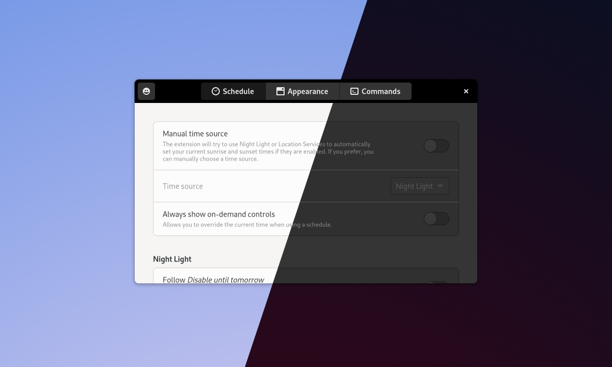

<!--
SPDX-FileCopyrightText: 2021 Romain Vigier <contact AT romainvigier.fr>
SPDX-License-Identifier: CC-BY-SA-4.0
-->

# Night Theme Switcher <!-- omit in toc -->



Automatically toggle your desktop’s color scheme between light and dark, switch backgrounds and run custom commands at sunset and sunrise.

Supports Night Light, Location Services, manual schedule and on-demand switch.

---

## Table of contents <!-- omit in toc -->

- [Graphical installation](#graphical-installation)
- [Command line installation](#command-line-installation)
- [Contributing](#contributing)

---

## Graphical installation

Visit [the extension page on extensions.gnome.org](https://extensions.gnome.org/extension/2236/night-theme-switcher/) and enable the extension.

## Command line installation

You will need these tools:

- `make`
- `gettext`
- `gnome-extensions` (comes with GNOME Shell >= 3.34)

Clone the repository and enter the directory:

```bash
git clone https://gitlab.com/rmnvgr/nightthemeswitcher-gnome-shell-extension.git && cd nightthemeswitcher-gnome-shell-extension
```

Build and install using `make`:

```bash
make build && make install
```

Restart your GNOME session and enable the extension:

```bash
gnome-extensions enable nightthemeswitcher@romainvigier.fr
```

## Contributing

You're welcome to contribute to the code or the translations! See [CONTRIBUTING.md](./CONTRIBUTING.md).
