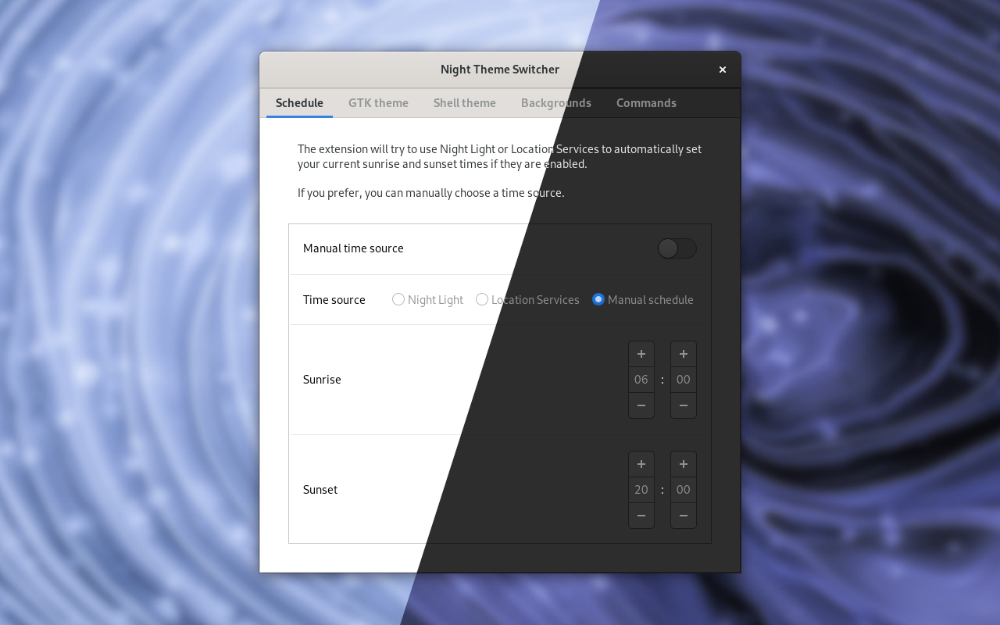

# Night Theme Switcher



Automatically toggle between your light and dark GTK theme variants when Night Light activates.

_Do you need to change your GNOME shell theme as well? Try [Night Shell Switcher](https://gitlab.com/rmnvgr/nightshellswitcher-gnome-shell-extension/)!_

## Theme compatibility

These themes have been tested and work:

- Adapta
- Adwaita (GNOME & Fedora default)
- Arc
- Canta
- ChromeOS
- Flat-Remix-GTK
- HighContrast
- Kimi
- Layan
- Matcha (Manjaro default)
- Materia
- Mojave
- Plata
- Pop (Pop!_OS default)
- Qogir
- Teja
- Vimix
- Yaru (Ubuntu default)

Other themes with a dark variant might work as well, let me know if there is a specific theme you'd like supported!

## Graphical installation

Visit [the extension page on extensions.gnome.org](https://extensions.gnome.org/extension/2236/night-theme-switcher/) and enable the extension.

## Command line installation

You will need these tools:

- `make`
- `gettext`
- `gnome-extensions` (comes with GNOME Shell >= 3.34)

Clone the repository and enter the directory:

```bash
git clone https://gitlab.com/rmnvgr/nightthemeswitcher-gnome-shell-extension.git && cd nightthemeswitcher-gnome-shell-extension
```

Install using `make`:

```bash
make install
```

Restart your GNOME session and enable the extension:

```bash
gnome-extensions enable nightthemeswitcher@romainvigier.fr
```

## Contributing

You're welcome to contribute to the code or the translations! See [CONTRIBUTING.md](./CONTRIBUTING.md).
